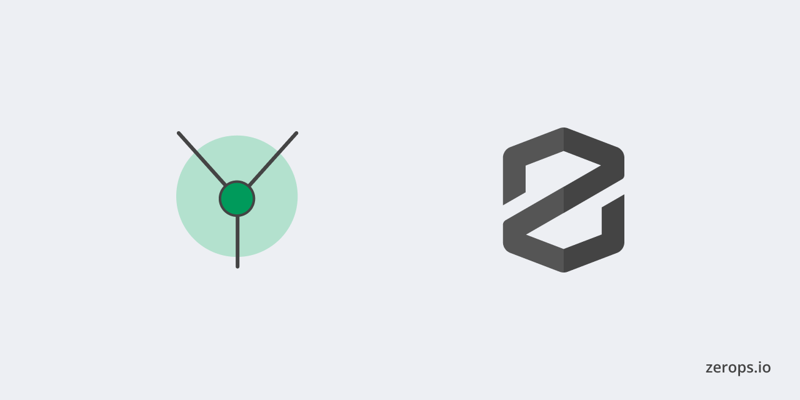

# Zerops x Yew - Rust




A Yew example for Zerops that you can deploy in 2 steps on zerops. Deploy multi-threaded front-end web apps with WebAssembly.

**Features**

- Yew
- Trunk

## Instructions to Deploy on Zerops

1. Navigate to the Zerops Dashboard and locate the import project button on the sidebar.

2. Paste the Project Yaml

```yaml
project:
  name: rust

services:
  - hostname: yew
    type: rust@1
    buildFromGit: https://github.com/fxck/zerops-yew
    ports:
      - port: 8080
        httpSupport: true
    enableSubdomainAccess: true
    minContainers: 1
```

If you still find yourself stuck in the process join our [Discord community](https://discord.gg/5ptAqtpyvh).
